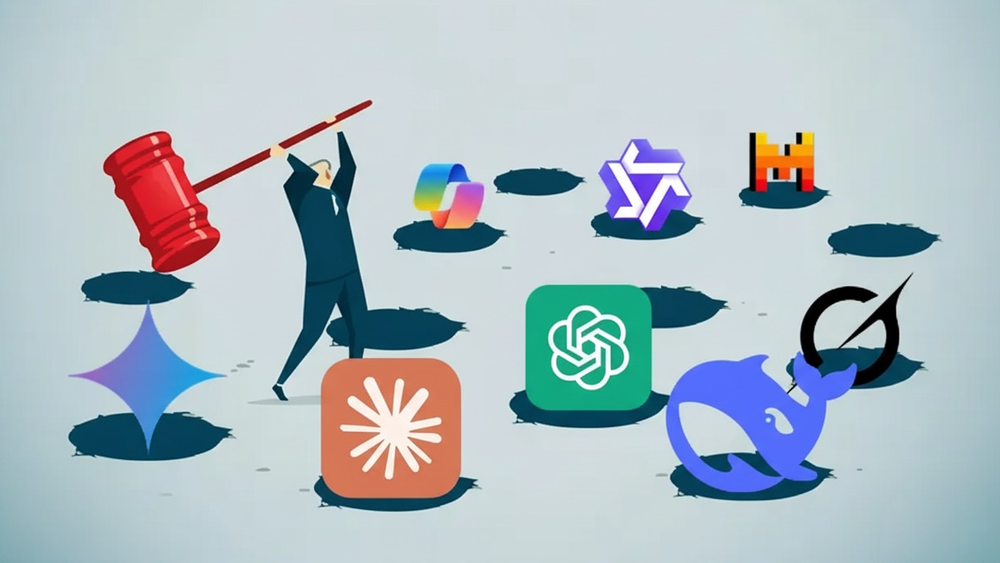

## Résumé

Près de **80 % des salariés** reconnaissent utiliser des outils d'IA non autorisés par leur employeur _\[1]_. Plus frappant encore : dans une autre enquête _\[2]_, **40 % déclarent qu'ils seraient prêts à enfreindre la politique interne** si cela leur permet d'aller plus vite.

Ce n'est pas de la rébellion. C'est de la survie.

Alors que les dirigeants y voient un problème de gouvernance, ce phénomène de **« Shadow AI »** ressemble en réalité à un immense **programme de R\&D gratuit** qui tourne déjà dans votre entreprise. Les collaborateurs vous montrent, en direct, où vos processus bloquent et où se cachent vos meilleures opportunités.

Tenter de bloquer ce comportement revient à jouer une pièce de **comédie sécuritaire**. La seule stratégie gagnante, c'est d'offrir une plateforme interne si performante que vos équipes **choisiront** naturellement de l'utiliser.

_**Bonus** : à la fin, nous partageons un [plan d'action en 3 étapes](#bonus--3-étapes-pour-reprendre-le-contrôle-du-shadow-ai) pour passer du constat à la mise en œuvre. Pas le temps de tout lire ? Sautez directement à la fin._

---

## Le Shadow AI est déjà là

Vos collaborateurs collent déjà des données sensibles dans ChatGPT, Gemini ou d'autres outils publics.

- **60 % l'avouent** _\[2]_.
- Les commerciaux y glissent des prévisions confidentielles.
- Les ingénieurs partagent du code propriétaire pour débugger.
- Les juristes résument des dossiers sensibles de fusion-acquisition.

Pourquoi ? Parce que la pression est énorme, et que les outils disponibles en interne sont **lents, lourds, ou inexistants**.

> Les employés ne rejettent pas vos règles. Ils rejettent l'inefficacité.

Le Shadow AI n'est pas un risque hypothétique. C'est déjà une réalité. Oui, il crée des problèmes de conformité et de sécurité, mais c'est aussi une **feuille de route (roadmap)**.

## Le Shadow AI = votre département R\&D gratuit

Chaque fois qu'un employé utilise un outil d'IA externe, il vous montre l'endroit précis où vos workflows cassent.

C'est de **l'expérimentation gratuite à grande échelle**. Si des centaines de collaborateurs contournent le même processus, vous n'avez pas seulement découvert un problème de sécurité, vous avez aussi découvert une **énorme opportunité**.

Bloquer cela revient à fermer votre laboratoire le plus innovant.

## Pourquoi bloquer est une impasse ?

La réaction instinctive de beaucoup de DSI ou RSSI est d'interdire ou de bloquer. Mais c'est jouer au jeu de la taupe indéfiniment, une illusion de sécurité :

1. **Les risques augmentent** : les salariés passent sur leurs appareils perso ou des applis douteuses, fragmentant encore plus vos données.
2. **La confiance s'effondre** : vos collaborateurs entendent : _«On ne vous fait pas confiance»_. C'est le meilleur moyen de démotiver vos talents.
3. **Vous prenez du retard** : pendant que vous jouez à la police, vos concurrents avancent. Les entreprises qui encadrent et adoptent l'IA iront plus vite, plus loin, et attireront les meilleurs talents.

Le vrai risque, c'est de **ne pas savoir** qui utilise quoi, où vont vos données, et comment vos décisions sont influencées par des sorties non vérifiées. Le blocage n'apporte aucune réponse à cela.

## L'alternative : rendre le Shadow AI superflu

On ne gagne jamais une guerre contre ses propres équipes. La seule façon d'éliminer le Shadow AI, c'est de le rendre inutile.

Concrètement : offrir une plateforme interne qui soit perçue comme un **saut en avant**, pas une version bridée de ChatGPT.

- **Collaborative** : sessions partagées, bibliothèques de prompts réutilisables, collaboration fluide.
- **Contextuelle** : connectée en toute sécurité à vos bases de connaissances internes.
- **Multi-modèles** : accès aux meilleurs modèles selon les tâches (voire : [Cessez de traiter l'IA comme une commodité](/fr/blog/stop-treating-ai-like-a-commodity)).

Les collaborateurs n'abandonneront pas le Shadow AI parce que vous l'interdisez. Ils l'abandonneront dès que vous leur proposerez mieux.

## Conclusion

Le Shadow AI n'est pas un acte de rébellion. C'est un **signal fort**. Il révèle là où vos équipes innovent pour contourner les blocages. Vous pouvez choisir de les sanctionner, ou transformer cette énergie en moteur de croissance.

Le choix est clair : arrêtez de jouer au jeu de la taupe. Déployez enfin la plateforme que vos collaborateurs demendent déjà.

---

## Bonus : 3 étapes pour reprendre le contrôle du Shadow AI

**Étape 1 : Cartographiez la réalité**

Lancez un audit non punitif pour comprendre où l'IA est déjà utilisée. Vous obtenez ainsi une feuille de route factuelle des cas d'usage prioritaires. _(Astuce : [contactez-nous](/fr/#contact-us), on vous envoie notre modèle d'audit.)_

**Étape 2 : Acheter ou construire ?**

Construire est lent et risqué. Une étude du MIT montre que l'achat réussit **3× plus souvent** que le développement interne _\[3]_. La stratégie gagnante est de livrer de la valeur maintenant, pas dans six mois.

**Étape 3 : Lancer un pilote ciblé**

Pas besoin d'un déploiement massif dès le départ. Démarrez par un pilote dans les équipes identifiées à l'étape 1. Ce pilote ne marchera que si la plateforme combine sécurité et contrôle pour les dirigeants, et expérience fluide et supérieure pour les employés.

C'est exactement l'équilibre que nous avons cherché à atteindre avec **Qasten** : une plateforme sécurisée et visible pour le management, et une expérience multi-modèles collaborative que les salariés ont envie d'utiliser.

➡️ **Réservez une [session stratégie pilote de 15 minutes](https://calendly.com/qasten/ai-strategy-session-15-min)** pour tracer vos premiers pas vers un Shadow AI transformé en valeur et en contrôle.

Pas encore prêt ? [Écrivez-nous](/fr/#contact-us) pour entamer la discussion.

---

#### Sources:

[1] _[New WalkMe Survey Shows Shadow AI Is Rampant; Training Gaps Undermine AI ROI - SAP News Center](https://news.sap.com/2025/08/new-walkme-survey-shadow-ai-rampant-training-gaps-undermine-roi/)_

[2] _[Nearly Half of Employees Are Using Banned AI Tools at Work - Newsweek](https://www.newsweek.com/nearly-half-employees-are-using-banned-ai-tools-work-2110261)_

[3] _[Buy, don't build - Fortune](https://fortune.com/2025/08/21/an-mit-report-that-95-of-ai-pilots-fail-spooked-investors-but-the-reason-why-those-pilots-failed-is-what-should-make-the-c-suite-anxious/)_
