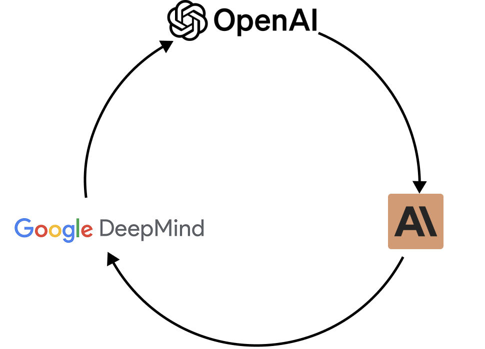

## Executive Summary:

**If you think cloud lock-in is bad, you're not ready for AI lock-in.**

You face a new strategic risk if:

- You're negotiating an exclusive, **multi-year deal** with a single AI vendor (e.g., OpenAI).
- You treat AI models as **interchangeable commodities**, like cloud servers.
- You believe **compliance** is solved by picking one "safe" provider.

This mindset is outdated and dangerous. With **GDPR** and the upcoming **EU AI Act**, the wrong AI strategy could expose your company to regulatory, financial, and competitive risks.

This article explains why AI requires a fundamentally different approach than cloud, and how European companies can build strategic autonomy in AI while staying compliant and future-proof.

_**Bonus:** At the end, we've included a [self-assessment](#bonus-self-assessment-is-your-ai-strategy-built-to-last) to help you stress-test your current AI strategy. If you're short on time, skip ahead, it may reveal **blind spots** you can't afford to ignore._

---

## Why AI is not the new Cloud

For the past decade, we treated cloud compute as a **commodity**. An AWS server was largely interchangeable with its Google Cloud equivalent.

This mindset, which served us well in building scalable infrastructure, is now leading organizations into a **strategic trap**.

**AI models are not commodities. Treating them this way is a category mistake**.

AI models don't just differ in **price**, they differ in **reasoning style**, **bias**, and **capabilities**. Choosing one AI provider is not like choosing between two electricity providers. It's like deciding your entire company will only ever use hammers, forbidding drills, wrenches, or saws.

This would not just be a poor procurement choice, but a voluntary surrender of your strategic autonomy!

## The Illusion of the "Best" Model: Chasing a Moving Target

In AI, there is no permanent winner:

- In 2023, **OpenAI**'s GPT-4 was the leader.
- In spring 2024, **Anthropic**'s Claude 3 overtook it in several key reasoning benchmarks.
- Months later, **OpenAI**'s GPT-4o leapfrogged with multimodal capabilities.
- By summer 2025, **Google**'s Gemini 2.5 Pro and **xAI**'s Grok 4 had caught up.
- Meanwhile, **Mistral AI** and other European players released models that outperform US competitors in specific tasks, especially in French and European contexts.

**The "best" model is a moving target.** Committing to a single vendor for a multi-year contract means betting your company's future on today's technology.

## Why There Is No "Best" Model: The Right Tool for the Job

The idea of a single "best" model to rule them all is a dangerous illusion. **What matters is using the right model for the right task.**

Here's a snapshot of how different needs map to different models at the time of writing:

_Source: https://artificialanalysis.ai/leaderboards/models_

| **Task**                              | **Model Requirements**                      | **Good Model Choices (Aug 2025)**                        |
| ------------------------------------- | ------------------------------------------- | -------------------------------------------------------- |
| Legal document analysis               | Long context window (1M+), strong reasoning | Claude Sonnet 4, Gemini 2.5, fine-tuned Llama 4          |
| Customer support ticket summarization | Fast, low-cost                              | gpt-oss-120B, Qwen3 30B, Mistral medium 3.1, Grok 3 mini |
| French content generation             | Cultural nuance, local and regional context | Mistral medium 3.1, Luth                                 |
| Creative ideation & marketing copy    | High creativity, stylistic flexibility      | GPT-5, Claude Opus 4, Gemini 2.5 Pro                     |

_⚠️ Important: This table is not exhaustive and will be outdated in weeks/months. The AI landscape moves too fast for any static models list to remain valid._

That's why a single-provider strategy is reckless. Companies who stay flexible will always have access to the latest, most cost-effective, and most relevent tools.

## Beyond the Model: The Multi-Provider Imperative

The need for diversification extends from **models** to the **providers** themselves. The same model (especially open source ones) can be accessed via different providers (Amazon Bedrock, Google Vertex, Mistral AI, etc.).

The flexibility of a multi-provider strategy is essential to stay in control:

1.  **Cost Arbitrage:** The cost to run a model on one platform can be significantly lower than on another. Intelligent routing is one of the simplest ways to save money.
2.  **Reliability and Failover:** Outages happen. A multi-provider setup ensures automatic failover, keeping business-critical workflows running.
3.  **Compliance and Sovereignty:** For European companies, this is non-negotiable. At times, you may need to run workloads exclusively on EU-based infrastructure to comply with GDPR or industry regulations. In other cases, you may want to leverage frontier US models for their cutting-edge capabilities.

**Just like there is a right model for a workload, there is a right provider for a workload.**

## From Chaos to Control: Enter the AI Gateway

**The answer to this complexity is not to retreat, but to build for it.** Managing multiple models and providers on many applications quickly becomes unmanageable without a unifying layer. This is where the **AI Gateway** comes in.

An AI Gateway acts as a control plane between your teams and the fragmented AI market, allowing you to:

- **Help meet compliance requirements** by centralizing governance, audit logs, and enforcing EU data routing.
- **Preserve sovereignty** by ensuring sensitive workloads can run on EU-based infrastructure.
- **Optimize costs** by routing tasks to the most efficient provider in real time.
- **Stay agile** by integrating new models in hours
- **Establish Full Control & Visibility** with a single dashboard for usage, costs, performance, and security.

Without an AI Gateway, AI adoption fragments into silos and risks. With it, **AI becomes a governed, shared capability that the whole enterprise can trust and scale.**

## Conclusion

**AI is not the new cloud. It's more volatile, more regulated, and more strategically sensitive.**

Companies that treat AI like the cloud, risk terrible lock-in, compliance failures, and loss of sovereignty. Companies that embrace a multi-model & multi-provider strategy gain control, agility, and independence.

**This is how European leaders build a durable AI advantage: by balancing innovation with sovereignty, and speed with control.**

---

## Bonus Self-Assessment: Is Your AI Strategy Built to Last?

As a leader, reflect on your current approach. Does your AI strategy have clear answers to these critical challenges?

- **Vendor Risk:** What happens if our primary AI provider has a major outage, doubles their prices, or is dramatically surpassed by a competitor?
- **Optimization:** Are we actively routing tasks to the most optimal model, or are we stuck with a costly "one-size-fits-all" approach?
- **Compliance & Sovereignty:** Can we guarantee, for any given task, that sensitive company and customer data will be processed within the EU to comply with GDPR and the upcoming AI Act?
- **Agility:** How quickly can we operationalize a breakthrough model from a new vendor next quarter? Hours or days?

If you hesitate on any of these, it's a sign that your AI strategy may be built on a fragile foundation.

**The good news: this is solvable.** With the right approach, AI can shift from a source of risk to a competitive edge.

**At Qasten, we're building a platform designed for European enterprises to help them stay flexible, compliant, and in control.**

➡️ Get in touch with us [here](/#contact-us) to explore how we can help strengthen your organization's resilience, sovereignty, and agility.
