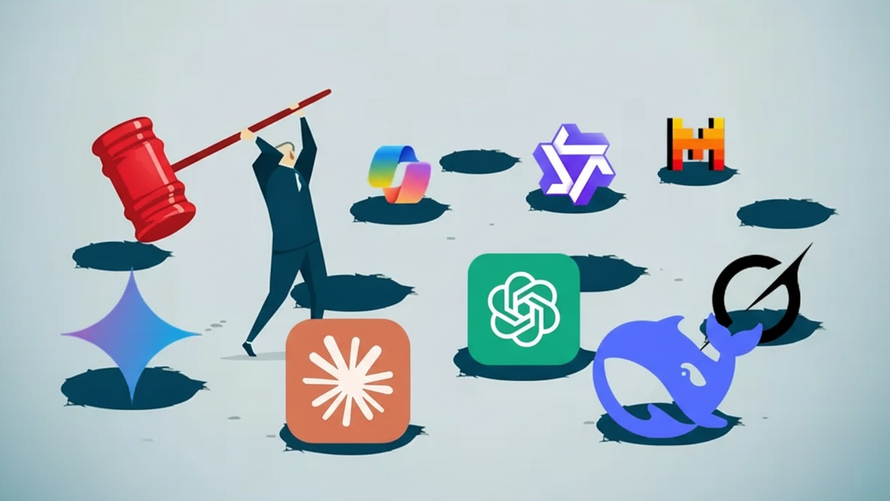

## Executive Summary

Nearly **80% of employees** admit to using AI tools not approved by their employer *[1]*. In another survey *[2]*, **half confessed to using banned tools at work**. Even more striking: **40% said they would knowingly break company policy** if it helped them work faster.

This isn't rebellion. It's survival.

While leadership sees a governance failure, this widespread **"Shadow AI"** is in fact a **massive, unpaid R&D program** running inside your company. Employees are showing you, in real time, where your processes are broken and where the biggest opportunities lie.

Blocking this behavior is a losing game of **security theatre**. The only winning move is to provide an internal platform so good that employees **choose** to use it.

_**Bonus:** At the end, we've included a [3-step action plan](#bonus-3-steps-to-take-control-of-shadow-ai) to help you move from diagnosis to action. If you're short on time, skip ahead._

---

## Shadow AI Is Already Here

Your employees are already pasting sensitive data into ChatGPT, Gemini, and other public tools.

- **60% admit** they've done it *[2]*.
- Sales teams are feeding confidential forecasts into public models.
- Engineers are uploading proprietary code for debugging.
- Legal teams are summarizing sensitive M&A documents.

Why? Because the pressure to deliver is immense, and the sanctioned tools are **slow, high-friction, or nonexistent**.

> Employees don't hate your rules. They hate inefficiency.

Shadow AI isn't a hypothetical risk. It's happening now. And while it creates compliance and security concerns, it's also a **roadmap**.

## Shadow AI = Your Unpaid R&D Department

Every time an employee turns to an external AI tool, they're telling you exactly where your workflows are broken.

This is **free experimentation at scale**. If hundreds of employees are hacking the same workflow, you haven't uncovered a security problem. You've uncovered a **huge opportunity**.

Blocking it is like shutting down your most innovative lab.

## Why Blocking Is a Losing Game?

The instinct of many IT departments is to ban or block. But this is **whack-a-mole security theatre**:

1. **It creates bigger risks**: Employees move to personal devices or unvetted apps, further fragmenting data and increasing exposure.
2. **It destroys trust**: Your most resourceful employees hear: _"We don't trust you."_. This is the fastest way to disengage your top performers.
3. **It guarantees you fall behind**: While you police, competitors empower. The companies that embrace and govern AI will out-innovate, out-pace, and out-recruit those stuck in banning mode.

The real risk is not knowing who is using what, where your data is going, or how decisions are being influenced by unverified outputs, and blocking doesn't solve that.

## The Alternative: Make Shadow AI Obsolete

You can't win a war against your own people. The only way to end Shadow AI is to make it unnecessary.

That means giving employees an internal platform that feels like an **upgrade**, not a downgrade:

- **Built for teams**: shared sessions, reusable prompt libraries, collaboration features.
- **Context-aware**: securely connected to your company's knowledge bases.
- **Multi-model by design**: access to the best models for each task, not just one (see: [Stop Treating AI like a commodity](/blog/stop-treating-ai-like-a-commodity)).

Employees won't abandon Shadow AI because you ban it. They'll abandon it the moment you give them something better.

## Conclusion

Shadow AI is not rebellion. It's a **signal**. It shows where employees are innovating around friction. You can either punish them for it, or use that energy to drive your business forward.

The choice is clear: stop playing whack-a-mole. Start deploying the platform your people are already asking for.

---

## Bonus: 3 Steps to Take Control of Shadow AI

**Step 1: Map Reality**

Run a non-punitive audit to see where employees already use AI. This gives you a data-backed roadmap of your highest-value use cases. _(Tip: [Contact us](/#contact-us) and we'll send you our audit template.)_

**Step 2: Decide Buy vs. Build**

Building is slow and risky. MIT research shows buying succeeds **3× more often** than building *[3]*. The strategic move is to deploy value now, not spend months reinventing infrastructure.

**Step 3: Launch a High-Value Pilot**

Don't roll out company-wide on day one. Start with a targeted pilot in the teams you identified in Step 1. This pilot will only succeed if the platform delivers on the leadership's demand for security and control while providing employees with a user experience that feels like an upgrade.

This is exactly the balance we designed **Qasten** to strike: a secure, visible, and compliant platform for leadership, and a collaborative, multi-model experience employees actually want to use.

➡️ [Get in touch](/#contact-us) with us to map your first steps from Shadow AI to immediate value and control.

---

### Sources:

[1] _[New WalkMe Survey Shows Shadow AI Is Rampant; Training Gaps Undermine AI ROI - SAP News Center](https://news.sap.com/2025/08/new-walkme-survey-shadow-ai-rampant-training-gaps-undermine-roi/)_

[2] _[Nearly Half of Employees Are Using Banned AI Tools at Work - Newsweek](https://www.newsweek.com/nearly-half-employees-are-using-banned-ai-tools-work-2110261)_

[3] _[Buy, don't build - Fortune](https://fortune.com/2025/08/21/an-mit-report-that-95-of-ai-pilots-fail-spooked-investors-but-the-reason-why-those-pilots-failed-is-what-should-make-the-c-suite-anxious/)_
